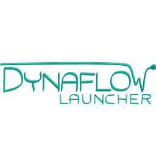

<!--
    Except where otherwise noted, content in this website is Copyright (c)
    2022, RTE (http://www.rte-france.com) and licensed under a
    CC-BY-4.0 (https://creativecommons.org/licenses/by/4.0/)
    license. All rights reserved.
-->

Dynaflow-launcher is a utility tool used to easily run [DynaFlow]({{ '/about/dynaflow' }}) starting from a minimal set of inputs.

It provides the following possibilities:
  - **Unitary simulations**: computation of the steady-state solution on a given network (IIDM format) with Dynaflow
  - **Systematic analysis**: assessment of the stability of a single base network subject to different events

More information is available on the [Github repository](https://github.com/dynawo/dynaflow-launcher) or in the [Dynaflow-launcher documentation](https://github.com/dynawo/dynaflow-launcher/releases/download/v1.5.0/DynaflowLauncherDocumentation.pdf).

{: width="50%" .center-image}
