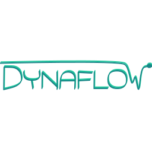

<!--
    Except where otherwise noted, content in this website is Copyright (c)
    2015-2020, RTE (http://www.rte-france.com) and licensed under a
    CC-BY-4.0 (https://creativecommons.org/licenses/by/4.0/)
    license. All rights reserved.
-->

**One important and fundamental simulation tool for real-time operation and planning studies of the power system is the steady-state calculation tool.** This tool focuses on the correct calculation of the system equilibrium point following one or several event(s): it ensures the existence of a steady-state point and enables to check that this point is acceptable for the system operator.

This calculation has been historically done by purely static simulation tool determining the final steady state by the combination of outer heuristic loops - trying to mimic the actions of special protection schemes, controllers and regulations - and an inner loop - classical power flow problem - solved several times. The recent and ongoing power system evolution - power-electronics based components, diverse and advanced controllers, etc. - makes this classical approach null and void for modern power system steady-state calculations. **Indeed, the steady-state point is determined by the difference of speeds of the various controls, regulations and special protection schemes dynamics**. It is thus absolutely necessary to represent the actions temporality to find the correct steady-state point and takes the best decisions when operating the system or planning new investments for the future.

**DynaFlow is a new steady-state simulation tool that aims at calculating the steady-state point by using a simplified time-domain simulation, guaranteeing the correctness of the solution found. In its current state, DynaFlow already covers a large range of the required features.**

**[Our examples](https://github.com/dynawo/dynawo/releases/download/v1.4.1/DynawoDocumentation.zip) show the pros of this approach compared to a classical static approach and provides a concrete illustration of DynaFlow's possibilities.**

In addition, in order to ease the creation of input data and the usability of DynaFlow, a separate project called [DynaFlow-launcher](https://github.com/dynawo/dynaflow-launcher). It enables to create all the necessary files from a single iidm file, based on predefinite rules for each component.

{: width="50%" .center-image}
