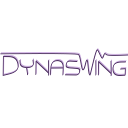

<!--
    Except where otherwise noted, content in this website is Copyright (c)
    2015-2020, RTE (http://www.rte-france.com) and licensed under a
    CC-BY-4.0 (https://creativecommons.org/licenses/by/4.0/)
    license. All rights reserved.
-->

**In order to protect the system against loss of synchronism or inter-area oscillations, the system operator has to conduct a large number of short-term stability studies.** Transient stability focuses on phenomena in the range of the ms and depends mainly on the active component models - synchronous machines and their controllers, HVDCs, Static Var Compensators.

To properly represent the system response in the few instants following an event, **it is necessary to combine open models with detailed physical modelling and transparent block control scheme with a very accurate solving method.** It is the association of these different features that enables to catch the correct system fast dynamics.

**DynaSwing is a simulation tool that offers an unique combination of a transparent, flexible and robust way of modelling - thanks to the intensive use of the Modelica language - and a state-of-the-art, efficient and accurate numerical method (the variable time-step solver IDA).**

**The core of the tool has already reached a mature state, making it usable for running transient stability studies, as visible in [our use cases documentation](https://github.com/dynawo/dynawo/releases/download/v1.6.0/DynawoDocumentation.zip)** The future work will thus concentrate on:
- the development of more elaborated regulation controls (PSS, specific governors or voltage regulators);
- the addition of new models (especially standard PV and wind models);
- the improvement of the numerical method on large test cases (especially on systems containing a lot of digital controllers).

These developments will contribute to enlarge the possibilities offered by DynaSwing.

{: width="50%" .center-image}