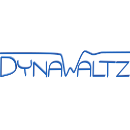

<!--
    Except where otherwise noted, content in this website is Copyright (c)
    2015-2020, RTE (http://www.rte-france.com) and licensed under a
    CC-BY-4.0 (https://creativecommons.org/licenses/by/4.0/)
    license. All rights reserved.
-->

**Long-term stability studies are a core process for ensuring power system stability: they enable to guarantee that the slow dynamics of the system don't lead to an instability or a system collapse.**

Most of the classical approaches for long-term stability studies use simplified models to reach acceptable simulation times on large-scale systems. The quasi steady-state simulation approach is the most widely known approximation: it consists in considering the fast dynamics stabilized and thus in replacing their differential nature by pure algebraic equations (for example, an integral control for voltage regulation can be considered instantaneous). While this technique globally provides acceptable results on most of the situations, **it involves a strong a priori hypothesis on the real system behavior.** This approximation is more and more questionable in a system where the multiplicity and diversity of the controls is exploding.

**Our long-term stability simulation tool DynaWaltz uses a different paradigm. Instead of doing a priori simplifications or hypothesis on the modelling side, it is the numerical method that will take charge of filtering the fast dynamics while keeping as detailed models as necessary.** Thanks to an intensive research work conducted during the Pegase project on the numerical method and an important effort on the simulation tool itself, DynaWaltz manages to achieve simular simulation times than current long-term stability simulation tools.

**DynaWaltz is the most advanced simulation tool of the Dyna&omega;o, initiative. It is operationnaly used on a daily basis in RTE national control center to deal with voltage stability issues.** In its operational use, DynaWaltz enables to launch individual simulation but also contingency analysis as well as  margin calculation thanks to the algorithms implemented in [Dynawo-algorithms]({{ '/about/dynalgo' }}).

For more details on DynaWaltz behavior, please have a look to [our use cases documentation](https://github.com/dynawo/dynawo/releases/download/v1.6.0/DynawoDocumentation.zip).

{: width="50%" .center-image}
