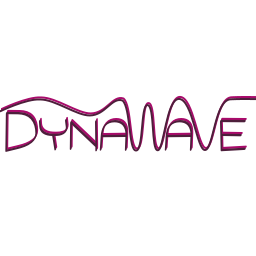

<!--
    Except where otherwise noted, content in this website is Copyright (c)
    2015-2020, RTE (http://www.rte-france.com) and licensed under a
    CC-BY-4.0 (https://creativecommons.org/licenses/by/4.0/)
    license. All rights reserved.
-->

**Being able to correctly design the future system and to anticipate the needed changes in grid codes and system regulations is critical to the ability to operate the grid in the future.** Indeed, the overall energy sector is going through a major evolution powered by a general will for clean energy that ends up in a move towards a larger development and integration of renewable energy sources in the power system.

**The traditional stability boundaries are challenged by this global change.** In a system with a high percentage of power electronics-based components, the classical phasor approach may be unadapted and unable to capture all the possible interactions between the different controllers themselves and between the controllers and the system, leading to inappropriate control and regulations designs that can end up in future large incidents on the system.

The aim of DynaWave is to propose a new simulation frame to correctly capture fast dynamics phenomena occuring in systems with a high penetration of renewable energy sources. **The modeling frame chosen would consist in a quasi-EMT approach, being more detailed than the phasor approach without encompassing the complexity of an EMT simulation.**

The development and release of some grid-forming controllers strategies and of dynamic lines are the first steps on which DynaWave will be built. They allow to simulate in a completely open-source environment the three nodes test case used in the [Migrate project](https://www.h2020-migrate.eu/) to study interactions between different grid-forming controllers (the test case is under final validation but will be released soon). **The idea is to build upon this first basis to develop more open-source models, in collaboration with our partner and colleagues conducting research on stability of power systems with a high-share of power electronics-based components.** DynaWave will provide a flexible and open-source simulation tool to ease technical discussions and collaborations in order to face the future stability challenges arising in power electronics-based systems.

{: width="50%" .center-image}
