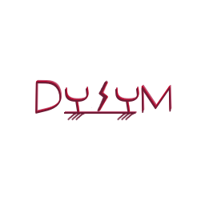

<!--
    Except where otherwise noted, content in this website is Copyright (c)
    2015-2020, RTE (http://www.rte-france.com) and licensed under a
    CC-BY-4.0 (https://creativecommons.org/licenses/by/4.0/)
    license. All rights reserved.
-->

**Short-circuit calculations are essential simulations for power system operators.** They are used to avoid large incidents on the system during its operation but also to avoid reaching situations that can damage materials, the environment or even injure people.

Until the recent years, the power system short-circuit behavior was mainly driven by the synchronous machines actions and the interesting result was obtained for the transient part following the event (around 100 ms after the event). Considering this, it was adequate enough to do one static calculation with a specific machine representation (E behind X) to analyze potential short-circuit issues. Nevertheless, the large introduction of power-electronics based components that can have very different behaviors, mainly defined by the tuning of their controls, deeply modify the system behavior during a short-circuit. **Short-circuit calculations have to evolve to accurately take into account the power-electronics based components participation during the fault.** 

**Our ambition with DySym is to provide a short-circuit simulation tool that is adapted to the current and future power system operators needs.** Through a time-domain approach correctly representing the different power system components and their contribution during the short-circuit, the user will have the possibility to output different values to further analyze the system behavior.

**DySym is at a research stage and we are currently playing around with different models to see which hypothesis make sense and which modelling choices should be done.** We plan to release a work plan at the beginning of next year to distribute a proof-of-concept tool next summer.

{: width="50%" .center-image}