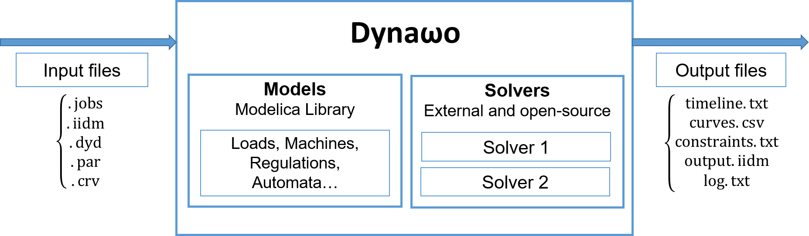
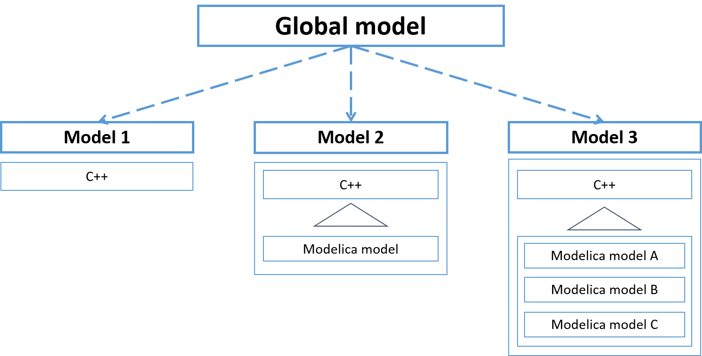
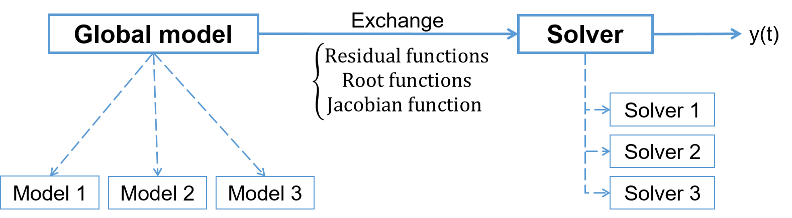
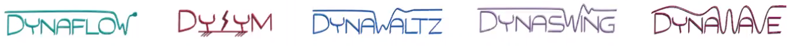
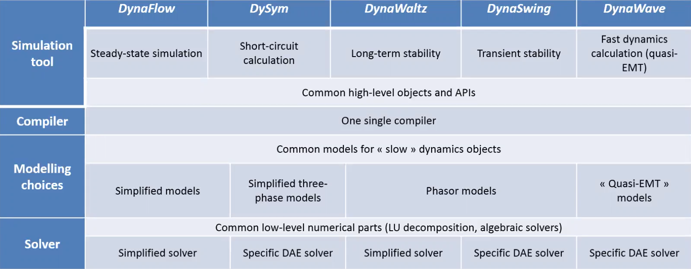

<!--
    Except where otherwise noted, content in this website is Copyright (c)
    2015-2019, RTE (http://www.rte-france.com) and licensed under a
    CC-BY-4.0 (https://creativecommons.org/licenses/by/4.0/)
    license. All rights reserved.
-->
The nature of power system is deeply evolving towards a more diverse and difficult to predict behaviour due to the massive changes going on in the power system (large penetration of power-electronic based components such as Renewable Energies Sources - RES - or High Voltage Direct Current - HVDC - lines, booming use of complex automata, control strategies or smart grids). Due to this radical change from physically-driven to numerically-driven dynamics, being able to assess the system stability becomes harder but is still essential as any generalized incident will be unacceptable for the economy and the consumers. This requires to have access to a transparent, flexible, robust and easy to use suite of simulation tools that will allow to run collaborative studies in a very simple way by sharing not only the same data but also the same modelling and solving choices in an open-source frame. Such a tool will ensure to get similar results and to agree upon optimal and shared actions on the system to accompany the ongoing changes in the best possible way. This analysis has motivated us to launch a new effort on simulation tools that finally ends up in the development of the Dyna&omega;o's software.

**To achieve this goal, Dyna&omega;o is based on two mains principles: the use of a high-level modelling language [Modelica](https://modelica.org/) and a strict separation between modelling and solving parts**. 

{: width="70%" .center-image}

Modelica is an equation-based, declarative and object-oriented modelling language that is easy to read and understand. The equations are written in a similar way than they are written in textbooks for example. Using this language enables to easily share and discuss the modelling choices done because the final models implementation is available in an understandable way, even for the end-user. The Modelica language is already used in different and various industrial sectors. It is important to mention that Modelica-based tools already exist (Dymola, OpenModelica, JModelica, etc.) but they are not efficient enough for large-scale simulation of power system, which was one of the motivation for developing Dyna&omega;o. In addition to this, the Modelica language itself has some limitations that are adressed in Dyna&omega;o by the possibility to use C++ models in a similar way as Modelica models.  Anyway, in the end all Modelica models are converted to C++ by Dyna&omega;o.

**In order to transform the Modelica code into an executable C code, Dyna&omega;o uses [OpenModelica](https://www.openmodelica.org/), which is an open-source Modelica-based modelling and simulation environment, and particularly the OpenModelica compiler.** OpenModelica is the Modelica open source environment that is the most widely used today in the Modelica community and that covers the best the language norm. As such and in order not to develop an in-house solution that will be difficult to maintain in the long-term, as well as to benefit from developments and progresses made for other industrial sectors simulations, we have made the choice to build Dyna&omega;o upon OpenModelica. In addition to the transformation done by the OpenModelica compiler, Python scripts are implemented into Dyna&omega;o to transform the outputs from the OpenModelica compiler in a generic frame that is also common to the C++ models available in Dyna&omega;o. All the thereby generated C++ models are then combined to build a global model that will interact with the solving part.

{: width="60%" .center-image}

To ensure acceptable performances both for compilation and simulation, a mechanism has been created into Dyna&omega;o to compile non squared Modelica models individually (for example a generator model by itself) and before the simulation. These compiled models are then only instantiated during the simulation. This strategy enables to use Dyna&omega;o for large-scale simulations (French EHV-HV networks - ie 250 000 continuous and 250 000 discrete variables) while keeping computation times in a range close to current simulation tools.

**The global model only exposes a few methods to the solvers** such as the residual functions, the Jacobian function or the zero-crossing functions. Having a separation between the modelling and the solving parts means that the choice of the numerical resolution method doesn't interfere with the models implementation. This feature has several advantages: it enables to easily test or use new solvers, it eases the addition of new model and it allows modelling experts not to bother about numerical difficulties and vice versa.

{: width="60%" .center-image}

**There are currently two solvers included into Dyna&omega;o:** 

* The first one is a fixed time-step solver developed for long-term stability studies that is based on works done during the European project Pegase. It is an order-1 Backward-Euler solver that focuses more on performances than on accuracy as there is no control error scheme and events are detected and applied in a synchronous way at time instants corresponding to the time step values;
* The second solver is the variable time-step variable order BDF solver called IDA and developed by the Lawrence Livermore National Lab as part of the [Sundials](https://computation.llnl.gov/projects/sundials) suite of solvers. Contrary to the first solver, IDA aims at running very accurate simulations by using a control error scheme and by detecting the exact instant corresponding to an event, thanks to its root findings mechanism;

One important idea in Dyna&omega;o is that the same models could be used for different stability studies. It is the overall association between the different models and the selected solving strategy that enables to run a specific stability study. For example, short-term stability studies and long-term stability studies share a large common set of models but use different solving strategies. Indeed, short-term stability studies are simulated using the IDA solver which manages to capture the fast dynamics while long-term stability studies are done with the simplified solver that approximates the fast dynamics but enables to study the system long-term behavior with very good simulation times.

**Dyna&omega;o 's primary focus has been on long-term and short-term stability studies** but the very encouraging results obtained and the flexibility of the approach led to **an extension of the initiative. Dyna&omega;o  is now evolving towards a complete and coherent suite of simulation tools**, sharing the same philosophy:
  - **[DynaFlow]({{ '/about/dynaflow' }})** for steady-state calculations
  - **[DySym]({{ '/about/dysym' }})** for short-circuit calculations
  - **[DynaWaltz]({{ '/about/dynawaltz' }})** for long-term stability simulations
  - **[DynaSwing]({{ '/about/dynaswing' }})** for short-term stability studies
  - **[DynaWave]({{ '/about/dynawave' }})** for stability studies and system design with a high-penetration of power-electronics based components (quasi-EMT)

{: width="70%" .center-image}

{: width="70%" .center-image}

 High level vision of the Dyna&omega;o initiative 

In addition two companions projects are provided:
  - **[Dynawo-algorithms]({{ '/about/dynalgo' }})** that provides utility algorithms to calculate complex key values of a power system (e.g. contingency analysis, voltage margin)
  - **[Dynaflow-launcher]({{ '/about/dfl' }})** to run DynaFlow with a minimal set of inputs

More details on the philsophy of Dyna&omega;o can be found in our [publications]({{ '/publications' }}).