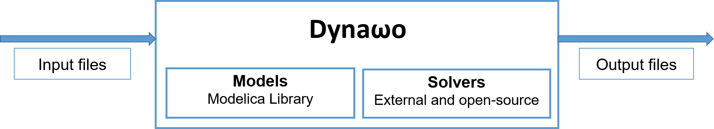
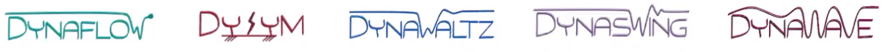

<!--
    Except where otherwise noted, content in this website is Copyright (c)
    2015-2019, RTE (http://www.rte-france.com) and licensed under a
    CC-BY-4.0 (https://creativecommons.org/licenses/by/4.0/)
    license. All rights reserved.
-->
**Dyna&omega;o is an hybrid C++/Modelica open source suite of simulation tools for power systems. It aims at providing power system stakeholders with a transparent, flexible, interoperable and robust suite of simulation tools that could ease collaboration and cooperation in the power system community.**

To achieve this goal, **Dyna&omega;o is based on two mains principles**: the use of a high-level modelling language [Modelica](https://modelica.org/) and a strict separation between the modelling and the solving parts. 

It is an ongoing project based on previous works conducted particularly in two R\&D European projects: Pegase and iTesla. These projects have contributed to the choices that are the basis upon which Dyna&omega;o is built: they proved the usability of the Modelica language for power system simulations and contributed to the development of numerical resolution strategies that are integrated into Dyna&omega;o.

{: width="70%" .center-image}

**Dyna&omega;o 's primary focus has been on long-term and short-term stability studies** but the very encouraging results obtained and the flexibility of the approach led to **an extension of the initiative. Dyna&omega;o  is now evolving towards a complete and coherent suite of simulation tools**, sharing the same philosophy:
  - **[DynaFlow]({{ '/about/dynaflow' }})** for steady-state calculations
  - **[DySym]({{ '/about/dysym' }})** for short-circuit calculations
  - **[DynaWaltz]({{ '/about/dynawaltz' }})** for long-term stability simulations
  - **[DynaSwing]({{ '/about/dynaswing' }})** for short-term stability studies
  - **[DynaWave]({{ '/about/dynawave' }})** for stability studies and system design with a high-penetration of power-electronics based components (quasi-EMT)

{: width="70%" .center-image}

**Only validated models, numerical methods and test cases are included into the [official release]({{ '/release_note' }}).** We plan to release [additional features]({{ '/roadmap' }}) in the near future, including for example additional models (IEC wind model, SPS models, etc.), or new test cases (Nordic32 test case, IEEE test cases).

In addition to the Dyna&omega;o repository, you can have a look to our new [dynawo-algorithms repository](https://github.com/dynawo/dynawo-algorithms), enabling to launch contingency analysis, voltage margin  or critical clearing time calculations.

Dyna&omega;o is an open source project licensed under the terms of the [Mozilla Public License](http://mozilla.org/MPL/2.0), v. 2.0.
The source code is hosted into a GitHub [repository](https://github.com/dynawo/dynawo).

Dyna&omega;o is using some external libraries to run simulations:
* [OpenModelica](https://www.openmodelica.org/), a Modelica environment developed and maintained by the Open Source Modelica Consortium distributed under a GPL V3.0 or OSMC Public License V1.2. The current version used is V1.13.2.
* [SUNDIALS](https://computation.llnl.gov/projects/sundials), a suite of solvers developed and maintained by the Lawrence Livermore National Lab and distributed under a BSD-3-Clause license. The 5.3.0 version is currently used.
* [SuiteSparse](http://faculty.cse.tamu.edu/davis/suitesparse.html), and in particular KLU, a LU decomposition library that is part of the suite sparse project, developed and maintained by T. A. Davis et al. at the University of Florida distributed under a LGPL-2.1+. The version 5.4.0 of suite sparse is the one used by Dyna&omega;o.
* [Adept](http://www.met.reading.ac.uk/clouds/adept/), an automatic differentiation library that has been developed and maintained at the University of Reading by R.J. Hogan distributed under Apache-2.0. It is the version 2.0.8 that is integrated into Dyna&omega;o.
* [Xerces-C++](http://xerces.apache.org/xerces-c/) a validating XML parser written in a portable subset of C++ and distributed under the Apache Software License, Version 2.0. The current version used is 3.2.2.
* [Libxml2](http://xmlsoft.org/), a XML C parser and toolkit distributed under the MIT License. The current version used is 2.9.4.
* [PowSyBl - iidm4cpp](https://www.powsybl.org/pages/documentation/developer/repositories/powsybl-iidm4cpp.html), a C++ implementation of the IIDM grid model and distributed under the MPL License, Version 2.0. The current version used is 1.4.0.
* [NICSLU](http://nicslu.weebly.com/) which is another LU decomposition library. It is developed and maintained by Tsinghua University and is optional at the moment into Dyna&omega;o. It is distributed under a GNU LGPL license.
* [jQuery](https://jquery.com/) that is distributed into Dyna&omega;o to display results into a minimalistic GUI after the simulation. The current version used is the 1.3.4 distributed under both a MIT and a GPL license.
* [cpplint](https://github.com/google/styleguide/tree/gh-pages/cpplint), a tool used during Dyna&omega;o compilation process to ensure that the C++ files follow the Google's C++ style. It is distributed under a CC-By 3.0 License.
