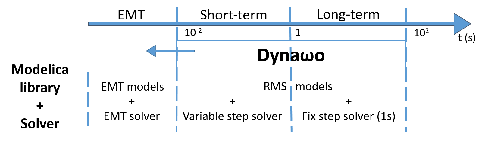

<!--
    Except where otherwise noted, content in this website is Copyright (c)
    2015-2019, RTE (http://www.rte-france.com) and licensed under a
    CC-BY-SA-4.0 (https://creativecommons.org/licenses/by-sa/4.0/)
    license. All rights reserved.
-->
**Dyna&omega;o is an hybrid C++/Modelica open source time domain simulation tool for power systems. It aims at providing power system stakeholders with a transparent, flexible, interoperable and robust simulation tool that could ease collaboration and cooperation in the power system community.**

To achieve this goal, **Dyna&omega;o is based on two mains principles**: the use of a high-level modelling language [Modelica](https://modelica.org/) and a strict separation between the modelling and the solving parts.

It is an ongoing project based on previous works conducted particularly in two R&D European projects: [Pegase](http://www.fp7-pegase.com/) and [iTesla](http://www.itesla-project.eu/). These projects have contributed to the choices that are the basis upon which Dyna&omega;o is built: they proved the usability of the Modelica language for power system simulations and contributed to the development of numerical resolution strategies that are integrated into Dyna&omega;o.

{: width="70%" .center-image}

**Dyna&omega;o's primary focus has been on RMS simulations and most of the tests done until now have been for long-term and short-term stability studies.** However, the simulation tool structure offers great flexibility and makes it also possible to run other types of power system simulations, as long as the user provides the necessary models and solvers. Different initiatives are under discussion or submission to test the possibility to use  Dyna&omega;o for EMT simulations or multi-system simulations.

{: width="60%" .center-image}

**Only validated models are included into the library that is still under construction.** We plan to release a new set of models in the near future, with for example HVDC, wind and solar power plants models or more different standard regulation models, etc.

Dyna&omega;o is an open source project licensed under the terms of the [Mozilla Public License](http://mozilla.org/MPL/2.0), v. 2.0.
The source code is hosted into a GitHub [repository](https://github.com/dynawo/dynawo).

Dyna&omega;o is using some external libraries to run simulations:
* [OpenModelica](https://www.openmodelica.org/), a Modelica environment developed and maintained by the Open Source Modelica Consortium distributed under a GPL V3.0 or OSMC Public License V1.2. The current version used is V1.9.4.
* [SUNDIALS](https://computation.llnl.gov/projects/sundials), a suite of solvers developed and maintained by the Lawrence Livermore National Lab and distributed under a BSD-3-Clause license. The 2.7.0 version is currently used.
* [SuiteSparse](http://faculty.cse.tamu.edu/davis/suitesparse.html), and in particular KLU, a LU decomposition library that is part of the suite sparse project, developed and maintained by T. A. Davis et al. at the University of Florida distributed under a LGPL-2.1+. The version 4.5.4 of suite sparse is the one used by Dyna&omega;o.
* [Adept](http://www.met.reading.ac.uk/clouds/adept/), an automatic differentiation library that has been developed and maintained at the University of Reading by R.J. Hogan distributed under Apache-2.0. It is the version 1.1 that is integrated into Dyna&omega;o.
* [NICSLU](http://nicslu.weebly.com/) which is another LU decomposition library. It is developed and maintained by Tsinghua University and is optional at the moment into Dyna&omega;o. It is distributed under a GNU LGPL license.
* [jQuery](https://jquery.com/) that is distributed into Dyna&omega;o to display results into a minimalistic GUI after the simulation. The current version used is the 1.3.4 distributed under both a MIT and a GPL license.
* [cpplint](https://github.com/google/styleguide/tree/gh-pages/cpplint), a tool used during Dyna&omega;o compilation process to ensure that the C++ files follow the Google's C++ style. It is distributed under a CC-By 3.0 License.
